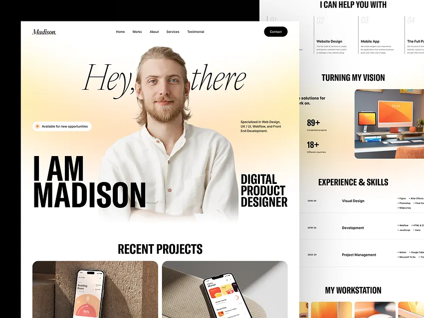

# Product Requirements Document (PRD)

# Muhammad Alan Andika Personal Portfolio Website

Version: 1.0

Status: Draft

Author: Muhammad Alan Andika

Target:
Full Stack Web Developer Internship Portfolio

---

# 1. Project Overview

## Background

This project is a modern personal portfolio website built to represent Muhammad Alan Andika as a Computer Science student preparing for Full Stack Web Developer internship opportunities.

Unlike a traditional portfolio that only lists projects and skills, this website should communicate Alan's growth journey through academic projects, organizations, teamwork, and continuous learning.

The website should leave the impression that Alan is a proactive student who enjoys building real-world software rather than simply completing university assignments.

The portfolio will be shared with recruiters, hiring managers, software engineers, internship programs, and technology companies.

---

# 2. Project Vision

Create a premium editorial-style portfolio website that feels modern, elegant, and memorable.

The website should immediately communicate professionalism while remaining personal.

Visitors should understand who Alan is within the first 15 seconds.

The website should feel closer to Apple, Linear, Framer, Vercel, and Raycast rather than a generic developer portfolio.

---

# 3. Objectives

Primary Objectives

• Build a memorable personal brand.

• Showcase real-world projects.

• Demonstrate frontend development quality.

• Present backend engineering experience.

• Increase internship opportunities.

Secondary Objectives

• Demonstrate engineering workflow.

• Showcase clean code architecture.

• Practice component-based frontend development.

• Become a long-term portfolio that can continue growing.

---

# 4. Target Audience

Primary Audience

• Software Engineering Recruiters

• HR

• Startup Founders

• Hiring Managers

• Technical Interviewers

Secondary Audience

• Fellow Students

• Lecturers

• Open Source Community

• Friends

---

# 5. Personal Branding

The website should consistently communicate the following identity.

Muhammad Alan Andika is

• Curious

• Responsible

• Friendly

• Fast learner

• Project-oriented

• Team player

• Computer Science student

• Aspiring Full Stack Web Developer

The portfolio should NOT present Alan as a senior engineer.

Instead, it should clearly communicate growth, curiosity, and willingness to learn.

---

# 6. Core Message

The website should communicate one central message.

"I continuously grow by building real-world projects."

Every section should reinforce this message.

Projects.

Organizations.

Skills.

Timeline.

Everything should support this narrative.

---

# 7. Website Tone

Professional

Modern

Minimal

Premium

Editorial

Elegant

Friendly

Confident

Never arrogant.

Never exaggerated.

Never flashy.

---

# 8. Visual Inspiration

Primary Design Reference

image.png

The attached design reference is the highest priority.

The implementation should preserve approximately 90–95% similarity regarding:

• Hero composition

• Typography hierarchy

• White space

• Editorial feeling

• Layout proportions

• Portrait positioning

• Premium aesthetic

The remaining sections should naturally continue the same visual language.

---

# 9. Design Philosophy

The website should feel like reading a premium magazine rather than browsing a resume.

Large typography.

Beautiful spacing.

Minimal UI.

Large photography.

Editorial layouts.

High readability.

Simple interactions.

The content should breathe.

Never overcrowd sections.

---

# 10. Design Principles

Priority 1

Readability

Priority 2

Visual hierarchy

Priority 3

Whitespace

Priority 4

Smooth interactions

Priority 5

Performance

Every design decision should follow these priorities.

---

# 11. Color Palette

Primary Background

Pure White

Secondary Background

Warm Beige Gradient

Primary Text

Near Black

Secondary Text

Gray 600

Accent

Warm Beige

Soft Shadow

Very subtle

No strong colors.

No gradients except warm lighting behind portrait.

---

# 12. Typography

Heading Font

Playfair Display

Alternative

Cormorant Garamond

Body Font

Inter

Alternative

Geist

Typography hierarchy must closely resemble the design reference.

Large serif hero.

Modern sans-serif body.

---

# 13. Tech Stack

Frontend

React 19

Vite

TypeScript

Tailwind CSS v4

Framer Motion

Lenis

Lucide React

React Icons

Deployment

Vercel

Package Manager

pnpm

Linting

ESLint

Formatting

Prettier

Version Control

Git

GitHub

---

# 14. Folder Structure

src/

assets/

components/

sections/

hooks/

lib/

data/

styles/

utils/

types/

App.tsx

main.tsx

Every major section should have its own component.

Reusable components should be placed inside components/.

Data must be separated from UI.

---

# 15. Coding Principles

Use functional components.

Use TypeScript everywhere.

No inline CSS.

No Bootstrap.

No jQuery.

No unnecessary dependencies.

Prefer composition over duplication.

Keep components reusable.

---

# 16. Performance Goals

Lighthouse

Performance > 95

Accessibility > 95

SEO > 95

Best Practices > 95

First Load

Under 2 seconds

Images

Lazy Loaded

Fonts

Optimized

Animations

GPU Accelerated

---

# 17. Accessibility

Semantic HTML

Keyboard Navigation

ARIA Labels

Image alt text

High contrast

Reduced motion support

Visible focus states

Accessible buttons

---

# 18. SEO

Title

Muhammad Alan Andika | Computer Science Student

Meta Description

Personal portfolio showcasing projects, organizations, and experience as a Computer Science student aspiring to become a Full Stack Web Developer.

Open Graph

Twitter Card

Favicon

Structured Metadata

---

# 19. Animation Philosophy

Animation should feel invisible.

It should support the experience.

Never distract.

Every movement should feel intentional.

Target inspiration

Apple

Framer

Linear

Raycast

Vercel

Avoid

Flashy effects

Bounce

Excessive rotations

Long delays
# — UI / UX SPECIFICATION

---

# 20. Information Architecture

The website should be a single-page application (SPA).

The navigation should smoothly scroll between sections.

Section order must remain exactly as follows:

1. Hero
2. About
3. Skills
4. Featured Projects
5. Organization & Volunteer Experience
6. Certifications
7. Contact
8. Footer

Do not rearrange the order.

Every section should smoothly transition into the next while maintaining consistent spacing and typography.

---

# 21. Layout Philosophy

The layout should feel calm.

Avoid visual clutter.

Use generous whitespace.

Avoid large blocks of text.

Create a reading experience similar to an editorial magazine.

Each section should feel independent while remaining visually connected.

---

# 22. Global Spacing System

Desktop Container Width

max-width: 1440px

Content Width

1200px

Section Padding

Top:
160px

Bottom:
160px

Mobile

Top:
96px

Bottom:
96px

Horizontal

Desktop:
64px

Tablet:
40px

Mobile:
24px

Never reduce spacing simply to fit more content.

Whitespace is part of the design.

---

# 23. Grid System

Desktop

12 Columns

Tablet

8 Columns

Mobile

4 Columns

Cards should align perfectly with the grid.

Avoid uneven spacing.

---

# 24. Navigation

Navigation Position

Fixed

Top

Transparent initially.

When scrolling:

Background becomes white.

Backdrop Blur enabled.

Small shadow appears.

Logo

ALAN

or

Muhammad Alan Andika

Menu

Home

About

Projects

Experience

Contact

Navigation should scroll smoothly.

Highlight active section.

---

# 25. Hero Section

Priority:
Highest

Height

100vh

Never shorter.

Never compressed.

This section defines the entire website.

The hero should closely follow image.png.

Target similarity:

95%

---

Hero Layout

Portrait

Centered

Large

Transparent PNG

Fade into background

Soft warm light behind portrait

Portrait occupies approximately 55% of hero width.

Do not crop portrait aggressively.

---

Typography

Behind portrait

Large italic serif text.

Very low opacity.

Acts as decorative typography.

Must not compete with foreground content.

---

Left Content

Large bold uppercase text.

Example

I AM

MUHAMMAD

ALAN

ANDIKA

This block should align to the left.

Large.

Confident.

Premium.

---

Right Content

Computer Science Student

Small description

Aspiring Full Stack Web Developer passionate about building modern web applications through real-world projects.

Maximum width

320px

Right aligned.

---

CTA Buttons

Primary

View Projects

Black background

White text

Rounded Full

Secondary

Download CV

White background

Black border

Rounded Full

Buttons should align horizontally.

---

Hero Background

Pure white.

Warm radial gradient behind portrait.

No abstract shapes.

No geometric decorations.

No floating blobs.

No random graphics.

---

Hero Animation

Initial Load

Navbar fades in.

Portrait fades up.

Large typography fades in.

Left content slides slightly from left.

Right content slides slightly from right.

Buttons fade up.

Animation Duration

700ms

Delay

100–300ms

Use easing

easeOutExpo

No bounce.

---

Scroll Behavior

Hero content should remain static.

No parallax.

No floating effects.

No exaggerated motion.

---

# 26. About Section

Layout

Two columns.

Left

Heading

Who I Am

Right

About paragraph.

Maximum width

700px

Below

Quick Facts

University

Current Semester

Location

Career Goal

Languages

Displayed as minimal cards.

---

# 27. Skills Section

Heading

Technical Skills

Subtitle

Technologies I work with.

Display

Responsive cards.

Categories

Programming Languages

Frontend

Backend

Database

Tools

Each card should have

Icon

Category

Technology list

Hover effect

Lift 6px

Soft shadow

Transition

300ms

---

# 28. Featured Projects

This section is the most important after Hero.

Use large editorial cards.

Cards should look premium.

Not like GitHub repositories.

Layout

Desktop

2-column

Tablet

2-column

Mobile

1-column

Each Project Card

Project Image

Project Title

Role

Short Description

Tech Stack

GitHub Button

Demo Button

Hover

Scale

1.02

Shadow

Soft

Border

Subtle

---

Project Image

16:9

Rounded

Cover

High quality

Never pixelated.

---

Project Description

Maximum

3 lines.

Do not create long paragraphs.

---

Tech Stack

Displayed as pills.

Rounded.

Minimal.

---

# 29. Organization & Volunteer

Layout

Modern Timeline

Vertical Line

Minimal

Professional

Each Timeline Item

Role

Organization

Date

Description

Do not exceed two lines.

---

# 30. Certifications

Grid Layout

Desktop

2 Columns

Mobile

1 Column

Card

Certificate Name

Issuer

Year

Credential Button

Preview Button (optional)

---

# 31. Contact

Simple.

Minimal.

Centered.

Include

Email

GitHub

LinkedIn

Portfolio

Resume Download

No contact form.

Only direct contact links.

---

# 32. Footer

Minimal.

White.

Thin border top.

Contains

Name

Copyright

Social Links

Back to Top button.

---

# 33. Motion Design

All animations should feel premium.

Inspired by

Apple

Framer

Linear

Vercel

Avoid

Bounce

Elastic

Zoom

Rotate

Heavy blur

Animation should be subtle.

Motion should never distract.

---

# 34. Scroll Animation

Every section fades into view.

Offset

15%

Duration

600ms

Use stagger animation for cards.

Children

Delay

80ms

---

# 35. Hover Interaction

Buttons

Darken slightly.

Cards

Lift

Shadow

Images

Scale

1.03

Icons

Rotate slightly

Only 2–3 degrees.

---

# 36. Cursor

Default browser cursor.

No custom cursor.

---

# 37. Responsive Behavior

Desktop First

1440px

Laptop

1280px

Tablet

768px

Mobile

390px

Every section must remain readable.

Never hide important content.

Never reduce font size below readability.

---

# 38. Visual Consistency

Every section must look like it belongs to the same design system.

Do not suddenly introduce colorful sections.

Do not change typography style.

Do not change border radius.

Do not change spacing rhythm.

Maintain the premium editorial feeling from the Hero section throughout the entire website.

#  — CONTENT STRATEGY & COPYWRITING

---

# 39. Content Philosophy

This portfolio should not feel like an online CV.

Instead, it should tell the story of a Computer Science student who continuously grows through building real-world projects.

Every section should contribute to one narrative:

"I learn by building."

Avoid generic wording.

Avoid exaggerated claims.

Avoid corporate buzzwords.

Write naturally.

Professional but personal.

---

# 40. Hero Copy

Large Heading

Muhammad
Alan
Andika

Role

Computer Science Student

Tagline

Aspiring Full Stack Web Developer passionate about building modern web applications and continuously growing through real-world software projects.

Primary Button

View Projects

Secondary Button

Download CV

Availability Badge

Available for Internship

---

# 41. About Section

Heading

Who I Am

Paragraph

I am a Computer Science student at Universitas Pendidikan Indonesia with a strong interest in Full Stack Web Development.

I enjoy transforming ideas into real applications that solve problems and create meaningful user experiences.

Throughout my academic journey, I have participated in collaborative software engineering projects involving web development, cloud computing, machine learning, and IoT.

For me, every project is an opportunity to improve my technical skills, communication, and teamwork while building software that delivers real value.

---

Quick Facts

University

Universitas Pendidikan Indonesia

Major

Computer Science

Current Semester

Semester 5

Location

Bandung, Indonesia

Career Goal

Full Stack Web Developer

---

# 42. Journey Timeline

Heading

My Journey

Timeline

2024

Started studying Computer Science at Universitas Pendidikan Indonesia.

↓

2025

Built the first collaborative web application.

Joined university organizations.

Began exploring backend development.

↓

2026

Completed multiple software engineering projects.

Cloud Computing

Machine Learning

Health Technology

Microservices

Started preparing for internship opportunities.

↓

Now

Continuously learning while building projects that solve real problems.

---

# 43. Skills Section

Heading

Technologies I Work With

Description

Here are the technologies I have used throughout academic and collaborative software projects.

Programming Languages

JavaScript

Go

Python

Frontend

HTML

CSS

Tailwind CSS

React

Vue.js

Backend

Node.js

Express.js

REST API

JWT Authentication

Microservices

Database

MySQL

PostgreSQL

SQLite

Supabase

Tools

Git

GitHub

Docker

Azure

Jenkins

Postman

VS Code

---

# 44. Featured Projects

Section Heading

Featured Projects

Subtitle

Projects that represent my learning journey and technical growth.

Display six projects.

Order

1

HealthPoint

2

Logistics Microservices

3

Demand Forecasting Wargi Kopi

4

Pancingin

5

BAQI Website

6

Smart Waste Bin

---

# 45. HealthPoint

Role

Backend Developer

Category

Dicoding Coding Camp 2026

Type

Team Project

Description

HealthPoint is an AI-assisted healthcare management platform designed to simplify patient consultations and appointment scheduling through integrated digital services.

My Contributions

Developed RESTful backend APIs.

Implemented authentication.

Built appointment scheduling services.

Collaborated with Frontend and AI teams.

Tech Stack

Node.js

Express.js

PostgreSQL

JWT

GitHub Button

Demo Button

---

# 46. Logistics Microservices

Role

Backend Developer

Category

Cloud Computing Final Project

Type

Team Project

Description

A cloud-native logistics platform using microservices architecture to improve delivery operations through independent services.

My Contributions

Developed Hub Service.

Developed Courier Service.

Built REST APIs.

Worked with Docker.

Integrated Azure deployment.

Worked with Jenkins pipeline.

Tech Stack

Express.js

Docker

Azure

Jenkins

REST API

---

# 47. Demand Forecasting Wargi Kopi

Role

Full Stack Developer

Category

Machine Learning Final Project

Description

A demand forecasting dashboard that helps coffee shop owners estimate future product demand and reduce unnecessary inventory waste.

My Contributions

Designed frontend dashboard.

Built backend APIs.

Integrated forecasting results.

Created data visualization.

Tech Stack

JavaScript

Node.js

Machine Learning

Chart.js

---

# 48. Pancingin

Role

Backend Developer

Category

Web & Mobile Programming

Description

A community platform that helps anglers discover fishing spots, share catches, discuss fishing experiences, and explore fishing equipment.

My Contributions

Developed backend APIs.

Designed authentication flow.

Implemented discussion features.

Integrated mobile frontend.

Tech Stack

Node.js

Express.js

TypeScript

Expo

---

# 49. BAQI Website

Role

Full Stack Developer

Category

Organization Website

Description

Official landing website introducing BAQI to prospective members through a modern responsive interface.

My Contributions

Designed UI.

Built responsive frontend.

Implemented website independently.

Tech Stack

HTML

Tailwind CSS

JavaScript

---

# 50. Smart Waste Bin

Role

IoT Team Member

Category

Internet of Things

Description

An intelligent waste bin capable of identifying organic and inorganic waste using computer vision and embedded systems.

My Contributions

Supported IoT implementation.

Collaborated with team members.

Participated in system testing.

Tech Stack

ESP32-CAM

MobileNetV2

IoT

---

# 51. Organization

Heading

Organizations & Leadership

Subtitle

Beyond technical projects, I actively contribute through student organizations and volunteer activities.

---

FORMACI UPI

Communication & Information Staff

February 2026 – Present

Managed social media content.

Designed promotional posters.

Created visual communication materials.

---

UKM BAQI

Secretariat Staff

February 2026 – Present

Managed organization assets.

Handled inventory.

Supported administrative operations.

Maintained equipment records.

---

MOKAKU UPI 2025

Logistics Staff

Volunteer

July 2025 – August 2025

Prepared logistics.

Supported event operations.

Distributed equipment.

Collaborated during university orientation.

---

# 52. Certifications

Heading

Learning Journey

Display

Belajar Fundamental Back-End dengan JavaScript

Dicoding Indonesia

2026

Future certificates should automatically continue inside this section.

---

# 53. Contact

Heading

Let's Connect

Description

I'm always open to internship opportunities, collaborations, or simply connecting with fellow developers.

Buttons

Email

LinkedIn

GitHub

Download CV

Portfolio

---

# 54. Footer

Copyright

© Muhammad Alan Andika

Closing Text

Designed and developed with React, TypeScript, Tailwind CSS, and lots of curiosity.

# — COMPONENT ARCHITECTURE & IMPLEMENTATION

---

# 55. Architecture Philosophy

This project must follow a component-driven architecture.

Every UI element should be reusable.

Avoid duplicated code.

Prefer composition over repetition.

Each section should be isolated into its own folder.

Business data should never be hardcoded inside components.

Separate data from presentation.

---

# 56. Project Structure

src/

├── assets/

├── components/

│   ├── common/

│   ├── ui/

│   ├── layout/

│   ├── animations/

│   └── icons/

│

├── sections/

│   ├── Hero/

│   ├── About/

│   ├── Skills/

│   ├── Projects/

│   ├── Organization/

│   ├── Certifications/

│   ├── Contact/

│   └── Footer/

│

├── data/

│   ├── projects.ts

│   ├── organizations.ts

│   ├── skills.ts

│   ├── certifications.ts

│   └── profile.ts

│

├── hooks/

├── lib/

├── styles/

├── utils/

├── types/

├── App.tsx

└── main.tsx

---

# 57. Component Hierarchy

App

↓

Navbar

↓

Hero

↓

About

↓

Skills

↓

Projects

↓

Organization

↓

Certificates

↓

Contact

↓

Footer

Each section should be completely independent.

---

# 58. Navbar Component

Responsibilities

Display logo.

Display navigation.

Highlight active section.

Handle mobile menu.

Provide smooth scrolling.

Sticky on top.

Transparent on hero.

Blur after scrolling.

Props

None

State

Current active section.

Menu open state.

---

# 59. Hero Component

This is the highest priority component.

Contains

Background

Portrait

Large typography

Role

Description

Buttons

Availability badge

The portrait must always remain centered.

The portrait should not shift horizontally on desktop.

The typography should never overlap important parts of the portrait.

The hero should fill the first screen completely.

---

# 60. About Component

Contains

Heading

Description

Quick facts

Layout

Desktop

2 Columns

Mobile

1 Column

No large paragraphs.

Maximum paragraph width

700px

---

# 61. Skills Component

Display cards.

Each category is generated from data.

No hardcoded skill list.

Each card contains

Icon

Category

Technology list

Hover animation

---

# 62. Project Component

Projects are generated dynamically.

Do not hardcode project cards.

Each project should come from

projects.ts

Card contains

Image

Title

Category

Description

Role

Tech Stack

GitHub

Demo

Optional Badge

---

# 63. Project Card Component

Props

title

description

image

role

category

stack

github

demo

featured

Responsibilities

Display project.

Hover animation.

Responsive.

Maintain aspect ratio.

---

# 64. Organization Component

Generated from

organizations.ts

Display

Timeline

Role

Organization

Date

Description

Modern vertical timeline.

Desktop

Alternating layout optional.

Mobile

Single column.

---

# 65. Certificate Component

Generated from

certificates.ts

Card contains

Certificate Name

Issuer

Year

Credential URL

Preview

---

# 66. Contact Component

Contains

Heading

Description

Email

LinkedIn

GitHub

CV

Simple.

Centered.

No contact form.

---

# 67. Footer Component

Contains

Name

Copyright

Built with React

Social Links

Back to Top Button

---

# 68. Data Management

Never store data inside JSX.

All content must come from

profile.ts

projects.ts

skills.ts

organizations.ts

certificates.ts

Future updates should only require editing data files.

---

# 69. Image Handling

Portrait

Transparent PNG

Stored in assets/profile/

Projects

Stored in assets/projects/

Certificates

Stored in assets/certificates/

Images must use lazy loading.

Use responsive sizing.

Avoid CLS.

---

# 70. Icons

Use Lucide React.

Avoid mixed icon libraries.

Maintain consistent stroke width.

Icon size

20px

24px

32px

Depending on context.

---

# 71. Button Component

Reusable.

Variants

Primary

Secondary

Ghost

Icon

Rounded Full

Accessible

Keyboard Focus

Hover

Active

Disabled

---

# 72. Card Component

Used by

Projects

Certificates

Skills

Common design

Rounded

Large padding

Soft border

Soft shadow

Hover lift

---

# 73. Section Component

Every section should use

SectionHeader

Component

Contains

Eyebrow

Title

Description

This creates consistency.

---

# 74. Section Header

Example

ABOUT

Who I Am

Short description

Centered

Spacing consistent.

---

# 75. Typography Component

Use utility classes.

Never inline font sizes.

Create reusable typography system.

Hero

Display

Heading

Subheading

Body

Caption

---

# 76. Responsive Rules

Desktop

1440+

Laptop

1280

Tablet

768

Mobile

390

Every component must adapt.

No horizontal scrolling.

---

# 77. Error Prevention

Never break layout.

Never overflow containers.

Avoid magic numbers.

Avoid fixed heights.

Prefer intrinsic sizing.

---

# 78. Future Scalability

The architecture should support future additions such as

Blog

Experience

Open Source

Achievements

Hackathons

Gallery

Testimonials

Without changing the existing structure.

---

# 79. Code Quality

Readable

Reusable

Scalable

Maintainable

Component-driven

Strong typing

No duplicated code

No unnecessary wrappers

Minimal nesting

Semantic HTML

---

# 80. Implementation Priority

Priority 1

Hero

Priority 2

Projects

Priority 3

About

Priority 4

Skills

Priority 5

Organization

Priority 6

Certificates

Priority 7

Contact

Priority 8

Footer

The Hero section must receive the highest implementation quality because it creates the first impression.

#  — MOTION DESIGN & INTERACTION SYSTEM

---

# 81. Motion Philosophy

Motion should enhance the experience rather than attract attention.

Every animation must have a purpose.

The website should feel calm, premium, and elegant.

The user should never consciously notice the animation.

Instead, the interface should naturally feel alive.

Motion inspiration:

• Apple
• Linear
• Framer
• Vercel
• Raycast
• Stripe

Avoid:

• Bounce
• Elastic
• Shake
• Excessive Scale
• Dramatic Rotation
• Long Delays

The portfolio should never feel playful.

It should feel refined.

---

# 82. Motion Library

Primary

Framer Motion

Smooth Scroll

Lenis

Optional

GSAP (only if absolutely necessary)

Avoid animation libraries that generate excessive effects.

---

# 83. Animation Timing

Fast

200ms

Normal

350ms

Slow

500ms

Large Entrance

700ms

Hero Entrance

900ms

Never exceed

1200ms

---

# 84. Animation Curve

Default

easeOut

Preferred

easeOutExpo

Hover

easeOutCubic

Never use

linear

Bounce

Elastic

---

# 85. Page Load Sequence

The website should load in this order.

Navigation

↓

Hero Background

↓

Portrait

↓

Large Decorative Typography

↓

Name

↓

Role

↓

Description

↓

Buttons

↓

Availability Badge

Never animate everything simultaneously.

Each element should feel intentional.

---

# 86. Navbar Motion

Initial

Transparent

While Scrolling

Background fades in.

Backdrop blur increases.

Small shadow appears.

Duration

300ms

Navigation links

Hover

Opacity transition

Underline grows smoothly.

---

# 87. Hero Motion

Portrait

Fade Up

Opacity

0 → 1

TranslateY

40px → 0

Duration

900ms

Large Typography

Fade

Opacity

0 → 0.15

Slow.

Decorative only.

Name

Slide

Left

20px

↓

0

Role

Slide

Right

20px

↓

0

Buttons

Fade Up

Delay

250ms

Availability Badge

Scale

0.96 → 1

Opacity

0 → 1

---

# 88. Scroll Reveal

Every section should animate only once.

Do not repeat animation.

Trigger

15% visible

Animation

Fade Up

Opacity

0 → 1

TranslateY

40px → 0

Duration

700ms

---

# 89. Stagger Animation

Cards should appear sequentially.

Delay

80ms

Maximum

120ms

Applies to

Projects

Skills

Certificates

Timeline

---

# 90. Hover Effects

Project Card

Lift

8px

Shadow

Increase softly

Image

Scale

1.03

Border

Slightly darker

Cursor

Pointer

Never rotate cards.

Never tilt cards.

---

# 91. Button Interaction

Hover

Darken

2%

TranslateY

-2px

Shadow

Soft

Active

TranslateY

0

Focus

Accessible outline

---

# 92. Skill Card

Hover

Lift

6px

Border

Accent

Icon

Scale

1.05

Transition

300ms

---

# 93. Timeline Motion

Each timeline item

Fade

Slide

Alternating

Desktop

Left

↓

Right

↓

Left

↓

Right

Mobile

Always bottom-up.

---

# 94. Project Image

Hover

Zoom

1.03

Duration

600ms

Overflow

Hidden

Rounded corners preserved.

---

# 95. Certificate Card

Hover

Lift

5px

Shadow

Increase

Border

Highlight

---

# 96. Contact Section

Icons

Hover

Move Up

2px

Opacity

Increase

No rotation.

---

# 97. Footer

Fade In

Very subtle.

Back To Top Button

Appears after scrolling.

Smooth fade.

---

# 98. Scroll Behavior

Use Lenis.

Scrolling must feel premium.

Target

60 FPS

Avoid sudden jumps.

Avoid browser default scrolling.

---

# 99. Loading Strategy

Images

Lazy Load

Portrait

Priority

Project Images

Lazy

Icons

Immediate

Fonts

Preload

---

# 100. Micro Interactions

Every clickable element should respond.

Examples

Buttons

Cards

Navigation

Icons

Links

Never leave clickable elements static.

---

# 101. Cursor Behavior

Use default browser cursor.

Do not implement custom cursor.

Do not use trailing effects.

---

# 102. Motion Accessibility

Respect

prefers-reduced-motion

If enabled

Disable

Large transitions

Parallax

Delayed animations

Only use fade.

---

# 103. Performance Rules

Never sacrifice performance.

Animation must use

transform

opacity

Avoid animating

width

height

left

top

Use GPU accelerated properties.

---

# 104. Animation Consistency

Every animation should belong to the same design language.

Do not mix animation styles.

The user should feel a single coherent motion system throughout the website.

---

# 105. Final Motion Goal

When someone opens the portfolio, the first impression should be:

"This feels like a premium product website."

Not:

"This is a student portfolio."

Motion should silently communicate craftsmanship, attention to detail, and professionalism.

#  — ENGINEERING IMPLEMENTATION RULES

---

# 106. Engineering Philosophy

The implementation must prioritize maintainability, readability, scalability, and user experience.

The codebase should look like it was written by a professional frontend engineer.

Avoid generating "AI-looking" code.

Every component should have a clear purpose.

Every file should be easy to understand.

Future contributors should immediately understand the project structure.

---

# 107. Primary Design Constraint

The attached reference image is the highest priority.

DO NOT redesign the website.

DO NOT reinterpret the layout.

DO NOT create a different hero section.

Instead:

Build a complete portfolio website that naturally extends from the design reference.

Maintain approximately 95% visual similarity for:

• Hero composition
• Typography hierarchy
• Portrait placement
• White space
• Layout rhythm
• Editorial feeling
• Premium aesthetic

The hero is the identity of this website.

Everything else should inherit its design language.

---

# 108. Hero Implementation Rules

The portrait must always stay centered.

Never move the portrait to the left or right.

Never convert the hero into a split-screen layout.

Never replace the centered portrait with a card.

The portrait should be transparent PNG.

Soft fade at the bottom.

Soft warm radial light behind portrait.

Large decorative serif typography behind portrait.

Large name on left.

Role on right.

CTA buttons centered below.

Hero height

100vh

---

# 109. Design Consistency

Every section must inherit:

Typography

Spacing

Color palette

Border radius

Shadow

Animation style

Interaction style

No section should suddenly feel like another template.

The entire portfolio should feel like one product.

---

# 110. Content Strategy

Never generate fake information.

Never invent achievements.

Never fabricate metrics.

Only use information supplied by the owner.

Placeholder content is acceptable until final content is provided.

---

# 111. Code Architecture

Use feature-based organization.

Each section owns:

Component

Styles (if necessary)

Animation

Assets

No giant files.

Target

< 250 lines per component.

Split large components into smaller reusable pieces.

---

# 112. React Guidelines

Use

Functional Components

Hooks

Composition

Props

TypeScript Interfaces

Avoid

Class Components

Inline functions when unnecessary

Deep prop drilling

Anonymous components

---

# 113. TypeScript Rules

Everything should be typed.

Avoid any.

Prefer interfaces.

Strict typing.

Reusable types.

Shared types inside

/types

---

# 114. Tailwind Rules

Use utility classes.

Do not create large CSS files.

Avoid custom CSS unless impossible.

Extract repeated patterns into reusable components.

---

# 115. Component Naming

PascalCase

Hero.tsx

Navbar.tsx

ProjectCard.tsx

TimelineItem.tsx

SectionHeader.tsx

Button.tsx

SkillCard.tsx

Footer.tsx

Never use

component1.tsx

newComponent.tsx

temp.tsx

---

# 116. File Naming

camelCase

for data

projects.ts

skills.ts

organizations.ts

profile.ts

PascalCase

for components.

---

# 117. Styling Rules

Rounded corners

Consistent

Large spacing

No random margins

No hardcoded pixel values where unnecessary

Prefer Tailwind spacing scale

---

# 118. Responsive Strategy

Desktop First

Maintain editorial layout.

Tablet

Rearrange gracefully.

Mobile

Stack content vertically.

Do not hide important information.

---

# 119. Images

Portrait

Transparent PNG

Optimized

Project images

16:9

Responsive

Lazy loaded

Certificates

Consistent ratio

Never stretch images.

---

# 120. Icons

Lucide React only.

Maintain consistent size.

Use outline style.

Avoid filled icons.

---

# 121. Accessibility

Use semantic HTML.

Section

Article

Header

Main

Footer

Accessible labels.

Keyboard navigation.

Visible focus.

Alt text.

Color contrast.

---

# 122. Performance

Target Lighthouse

Performance

95+

Accessibility

95+

Best Practices

95+

SEO

95+

Avoid unnecessary packages.

Optimize bundle size.

Lazy load heavy assets.

---

# 123. State Management

No Redux.

No Zustand.

Local state is sufficient.

Use Context only if necessary.

Keep state minimal.

---

# 124. Data Source

The website should not hardcode content.

All profile information must come from data files.

Future editing should only require modifying:

profile.ts

projects.ts

organizations.ts

skills.ts

certifications.ts

---

# 125. Reusability

Every card should be reusable.

Project cards

Skill cards

Timeline cards

Certificate cards

Section titles

Buttons

Containers

Should all be reusable.

---

# 126. Future Expansion

The architecture must support future sections.

Possible additions:

Experience

Blog

Articles

Achievements

Hackathons

Gallery

Open Source

Without major refactoring.

---

# 127. Git Standards

Meaningful commits.

Examples

feat: add hero section

feat: implement project cards

fix: responsive navbar

refactor: reusable section header

Avoid

update

fix

new

without context.

---

# 128. Code Comments

Comment only when necessary.

Explain reasoning.

Not obvious code.

Avoid excessive comments.

---

# 129. AI Coding Rules

When implementing code:

Do not generate placeholder architecture.

Generate production-quality code.

Avoid duplicated utilities.

Avoid deeply nested JSX.

Prefer readability over cleverness.

Think like a senior frontend engineer.

---

# 130. Acceptance Criteria

The implementation is considered successful if:

✓ Hero closely matches the provided design reference.

✓ The portrait remains centered.

✓ The visual hierarchy is preserved.

✓ Every section follows the same design language.

✓ Components are reusable.

✓ Data is separated from UI.

✓ Responsive on desktop, tablet, and mobile.

✓ Animations feel premium.

✓ Lighthouse scores exceed 95.

✓ Codebase is maintainable.

✓ The portfolio feels like a premium product website rather than a student assignment.

---

# 131. Final Development Goal

The completed portfolio should communicate one clear message:

"This is a Computer Science student who learns by building real-world software."

The visitor should leave the website remembering the journey, the projects, and the professionalism — not the technology stack alone.

The website should feel elegant, intentional, and memorable.

Quality is more important than complexity.

Every design decision should support clarity, storytelling, and craftsmanship.

#  — DESIGN SYSTEM

---

# 132. Design Philosophy

The design system should create a premium, elegant, editorial, and modern experience.

Every UI element must feel like it belongs to the same product.

The interface should communicate quality through simplicity rather than decoration.

The visual language should remain consistent throughout the website.

Design inspiration:

- Apple
- Linear
- Framer
- Vercel
- Raycast
- Stripe

Avoid:

- Template-looking layouts
- Overly colorful interfaces
- Heavy gradients
- Excessive glassmorphism
- Neumorphism
- Random shadows

---

# 133. Color Tokens

## Primary Background

#FFFFFF

---

## Secondary Background

#FAF8F6

---

## Surface

#FFFFFF

---

## Primary Text

#111111

---

## Secondary Text

#5F6368

---

## Muted Text

#9AA0A6

---

## Border

#ECECEC

---

## Accent

#DCC8B3

---

## Hover Accent

#C8AF96

---

## Success

#16A34A

---

## Shadow

rgba(0,0,0,0.06)

---

# 134. Typography

Hero Display

Playfair Display

Weight

700

Size

Desktop

96px

Tablet

72px

Mobile

52px

---

Section Title

Playfair Display

56px

---

Section Heading

Inter

36px

---

Card Title

Inter

24px

---

Body

Inter

18px

---

Small Text

Inter

15px

---

Caption

Inter

13px

---

Line Height

Body

170%

Heading

120%

Hero

95%

---

# 135. Spacing Scale

4

8

12

16

20

24

32

40

48

64

80

96

120

160

Use only this spacing scale.

Never invent arbitrary spacing.

---

# 136. Border Radius

Button

999px

Card

28px

Image

32px

Input

20px

Badge

999px

Avatar

50%

---

# 137. Shadow System

Small

0 4px 12px rgba(0,0,0,0.04)

Medium

0 12px 30px rgba(0,0,0,0.08)

Large

0 24px 60px rgba(0,0,0,0.10)

Never use strong shadows.

Shadows should only provide subtle depth.

---

# 138. Container Width

Desktop

1440px

Content

1200px

Text

720px

Wide Section

1320px

---

# 139. Grid System

Desktop

12 Columns

Gap

32px

Tablet

8 Columns

Gap

24px

Mobile

4 Columns

Gap

16px

---

# 140. Button System

## Primary

Black background

White text

Rounded Full

Hover

Background slightly lighter

Lift 2px

---

## Secondary

White background

Black border

Black text

Hover

Soft gray background

---

## Ghost

Transparent

Underline on hover

---

## Icon Button

Circle

Minimal

Outline

---

# 141. Card System

Cards should share one visual language.

Common characteristics

- White background
- Rounded corners
- Soft border
- Soft shadow
- Large padding
- Hover lift
- Clean typography

Cards

Projects

Skills

Certificates

Timeline

Quick Facts

Should all inherit this system.

---

# 142. Icon System

Library

Lucide React

Stroke Width

2

Default Size

22px

Feature Icons

28px

Section Icons

20px

Never mix icon styles.

---

# 143. Image Rules

Profile Image

Transparent PNG

Centered

Large

Fade at bottom

No visible background

---

Project Images

16:9

Rounded

High Resolution

Optimized

---

Certificate Images

Consistent aspect ratio

White border

Rounded

---

# 144. Section Rules

Every section should contain

Eyebrow

↓

Large Heading

↓

Short Description

↓

Main Content

↓

Whitespace

Maintain consistent vertical rhythm.

---

# 145. Divider Rules

Avoid heavy dividers.

Prefer whitespace.

If needed

1px

#ECECEC

---

# 146. Badge System

Rounded Full

Small

Minimal

Used for

Status

Availability

Project Category

Tech Stack

---

# 147. Tech Stack Tags

Rounded

Small

Soft gray background

No bright colors

Padding

Horizontal

12px

Vertical

6px

---

# 148. Scrollbar

Thin

Minimal

Thumb

Gray

Track

Transparent

---

# 149. Selection

Background

Black

Text

White

---

# 150. Loading Skeleton

Use subtle gray blocks.

Rounded corners.

Fade animation.

No shimmer.

---

# 151. Empty States

Simple illustration optional.

Minimal copywriting.

Avoid decorative graphics.

---

# 152. Responsive Typography

Desktop

Hero

96px

Tablet

72px

Mobile

52px

Section

56

44

36

Body

18

17

16

---

# 153. Consistency Rules

Every section must look like it belongs to one design system.

Do not introduce new colors.

Do not change typography hierarchy.

Do not change border radius.

Do not introduce different shadow styles.

Maintain consistency across the entire experience.

---

# 154. Final Design Principle

If a new component is added in the future, it must inherit this design system without introducing a different visual language.

The website should feel cohesive, timeless, premium, and intentionally designed from the first section to the footer.

#  — IMPLEMENTATION PROTOCOL & ACCEPTANCE CRITERIA

---

# 155. Implementation Philosophy

The objective is not to simply build a portfolio website.

The objective is to craft a premium digital experience that represents Muhammad Alan Andika as a Computer Science student preparing for Full Stack Web Developer internship opportunities.

Every implementation decision should prioritize quality over speed.

Every interaction should feel intentional.

Every animation should support the storytelling.

Every component should reinforce the personal brand.

The final product should feel handcrafted rather than AI-generated.

---

# 156. Development Workflow

The implementation should follow the following sequence.

STEP 1

Read this PRD completely.

Do not start coding before understanding the entire document.

---

STEP 2

Analyze image.png.

The image is the highest priority design reference.

Study

• Composition

• Layout

• Typography

• Portrait placement

• White space

• Editorial hierarchy

• Color feeling

---

STEP 3

Analyze existing project structure.

Understand

Components

Assets

Data

Folder structure

Libraries

Current implementation

---

STEP 4

Plan component architecture.

Avoid directly editing everything.

Identify reusable components first.

---

STEP 5

Implement layout.

Only after layout is complete:

Implement animation.

---

STEP 6

Implement responsive behavior.

Desktop first.

Tablet second.

Mobile last.

---

STEP 7

Optimize.

Performance

Accessibility

SEO

Animation

Image loading

---

STEP 8

Refactor.

Simplify.

Remove duplicated code.

Improve readability.

---

STEP 9

Verify every section against this PRD.

Nothing should violate the requirements.

---

# 157. Design Priority

Priority 1

Hero Section

Priority 2

Projects

Priority 3

About

Priority 4

Skills

Priority 5

Organization

Priority 6

Certificates

Priority 7

Contact

Priority 8

Footer

Never sacrifice Hero quality to improve lower priority sections.

---

# 158. Content Rules

Never generate fake information.

Never invent achievements.

Never exaggerate experience.

Never create fictional projects.

Never create unrealistic metrics.

If information is missing, use placeholder text and leave clear TODO comments.

---

# 159. Coding Rules

Always write production-quality code.

Never generate temporary code.

Avoid unnecessary comments.

Avoid duplicated components.

Avoid deeply nested JSX.

Prefer readability.

Prefer maintainability.

Prefer reusable architecture.

---

# 160. React Rules

Use

React

TypeScript

Functional Components

Hooks

Composition

Interfaces

Memoization only when beneficial.

Avoid premature optimization.

---

# 161. Tailwind Rules

Prefer utility classes.

Avoid unnecessary custom CSS.

Use Tailwind spacing scale.

Use Tailwind typography.

Keep class ordering readable.

---

# 162. Accessibility Checklist

Every image

Alt text

Every button

Accessible label

Every interactive element

Keyboard accessible

Proper heading hierarchy

Semantic HTML

Visible focus states

ARIA labels where necessary

---

# 163. Performance Checklist

Lazy load images.

Optimize PNG.

Avoid layout shift.

Minimize bundle size.

Avoid unnecessary dependencies.

Maintain smooth scrolling.

Target Lighthouse score:

Performance > 95

Accessibility > 95

SEO > 95

Best Practices > 95

---

# 164. Responsive Checklist

Desktop

Perfect

Laptop

Perfect

Tablet

Optimized

Mobile

Optimized

No horizontal scrolling.

No overlapping text.

No clipped content.

---

# 165. Animation Checklist

Hero animation

Smooth

Scroll reveal

Smooth

Hover

Subtle

Navigation

Elegant

Cards

Consistent

Buttons

Responsive

Never use excessive animation.

---

# 166. Hero Verification

The Hero must preserve approximately 95% similarity to image.png.

Checklist

✓ Portrait centered

✓ Portrait transparent

✓ Warm background

✓ Serif decorative typography

✓ Large left heading

✓ Right-side role description

✓ Premium spacing

✓ White dominant background

✓ Editorial composition

If one of these items changes significantly, the Hero must be revised.

---

# 167. Visual Consistency Checklist

Every section should follow:

Same spacing rhythm

Same typography

Same border radius

Same shadow system

Same animation system

Same color palette

No section should feel disconnected.

---

# 168. Code Quality Checklist

✓ TypeScript strict

✓ Reusable Components

✓ Data separated from UI

✓ Clean folder structure

✓ Strong typing

✓ No duplicated logic

✓ Semantic HTML

✓ Minimal CSS

✓ Clean naming

---

# 169. Git Workflow

Use meaningful commits.

Examples

feat(hero): implement editorial hero layout

feat(projects): add reusable project cards

feat(about): implement personal journey section

refactor(ui): extract reusable button component

fix(responsive): improve mobile spacing

Avoid vague commit messages.

---

# 170. Definition of Done

The project is considered complete only if:

The Hero closely matches the reference image.

All required sections are implemented.

The website is fully responsive.

Animations feel smooth and premium.

The design language remains consistent.

The portfolio tells a coherent story.

Projects are dynamically rendered.

Organization and certifications are displayed.

Performance targets are achieved.

Accessibility requirements are met.

Code is clean and maintainable.

The website is deployment-ready.

---

# 171. Future Improvements

Future versions may include:

Blog

Project Detail Pages

Dark Mode

Interactive Timeline

GitHub API Integration

Contact Form

Visitor Analytics

Project Filtering

Internationalization

These features should be supported without major architectural changes.

---

# 172. Final Product Vision

The finished portfolio should leave the following impression:

"This is not just another student portfolio.

This is a thoughtfully crafted product that reflects the mindset of someone who enjoys building software, values quality, and continuously grows through real-world projects."

The portfolio should communicate professionalism through simplicity, consistency, and craftsmanship.

Quality should always take precedence over quantity.

